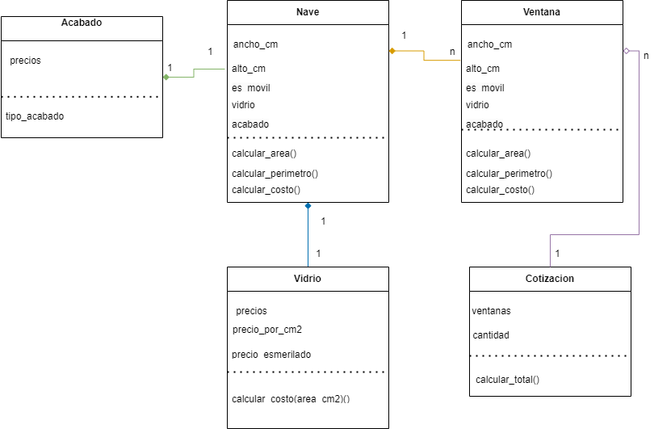

# Diagrama de Clases del Sistema de Cotización de Ventanas

## Clases Principales:

1. **Acabado**: Representa los diferentes tipos de acabados disponibles para las naves de las ventanas, como pulido, lacado brillante, lacado mate y anodizado .
2. **Nave**: Define una sección de una ventana, ya sea fija o móvil, incluyendo su dimensionamiento y materiales utilizados.
3. **Ventana**: Agrupa naves para formar una ventana completa en diferentes estilos como O, XO, OXO y OXXO.
4. **Vidrio**: Define los tipos de vidrio que pueden ser usados en las naves, incluyendo características como el precio por centímetro cuadrado y si es esmerilado o no.
5. **Cotizacion**: Encapsula la lógica para cotizar uno o más tipos de ventanas, aplicando descuentos y calculando el costo total.

## Relaciones Entre Clases:

1. **Nave - Acabado**: Cada nave tiene asociado un objeto de tipo `Acabado`, lo que permite calcular costos basados en el tipo de acabado elegido.
2. **Nave - Vidrio**: Cada nave contiene un objeto de tipo `Vidrio`, necesario para calcular el costo del vidrio usado en la nave según su área.
3. **Ventana - Nave**: Una ventana está compuesta de múltiples naves, ya sean fijas o móviles. La relación es de composición, indicando que las naves no pueden existir sin la ventana.
4. **Cotizacion - Ventana**: Una cotización puede incluir múltiples ventanas. Esta relación permite agrupar diferentes ventanas en una sola cotización y calcular el costo total.

## Interpretación del Diagrama:

Este diagrama UML muestra cómo se estructura el sistema de cotización de ventanas. Destaca las principales entidades involucradas y sus interacciones, facilitando la comprensión de las responsabilidades de cada clase y cómo colaboran para calcular el costo de diferentes configuraciones de ventanas. Las relaciones de composición entre Ventana y Nave, así como la integración de objetos de tipo Acabado y Vidrio en Nave, son clave para el funcionamiento dinámico y flexible del sistema, permitiendo extensibilidad y mantenimiento del código a lo largo del tiempo.
### Diagrama UML:

